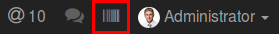
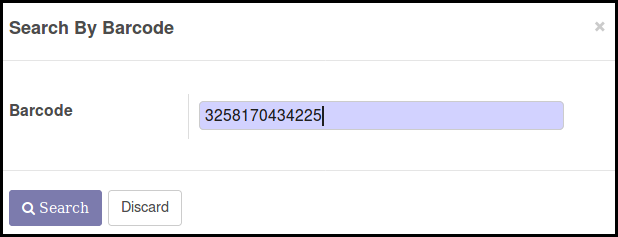
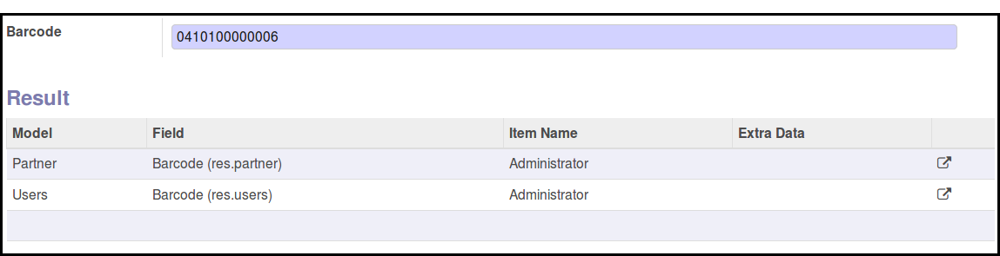
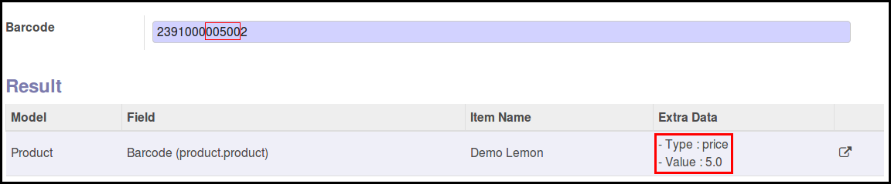

* In the main menu click on the barcode new button

* In the pop up form, enter the barcode and click on the search button

**Case 1: One item found**

If an item is found, the pop up is closed, and the form view of the item is
displayed. (Demo data with ``0419100000009`` to search a partner)

**Case 2: Many items found**

If many items are found, the list of the items are displayed and the user
can go on the according form view by clicking on the button on the end of
the line. This case can occur:

* in a normal case, if a barcode is associated to many models. Two typical
  cases are : product.product / product.template and res.users / res.partner.
  (Demo data with ``3057068106783`` to search a product)

* if the database is corrupted, and a barcode is set to many differents
  items.

**Case 3: Barcode with specific rule**

In some specifics cases when the barcode contains extra data (like price
or weight), the barcode will be different than the product barcode.
In that case, the item is displayed, and the data is analysed.

Exemple : Barcode ``2391000005002`` when:

* ``23`` is a prefix
* ``91000`` is a base code of the product
* ``00500`` is the price
* ``2`` is a control digit

If this barcode is entered, the product with the barcode ``2391000000007`` will
be returned.

