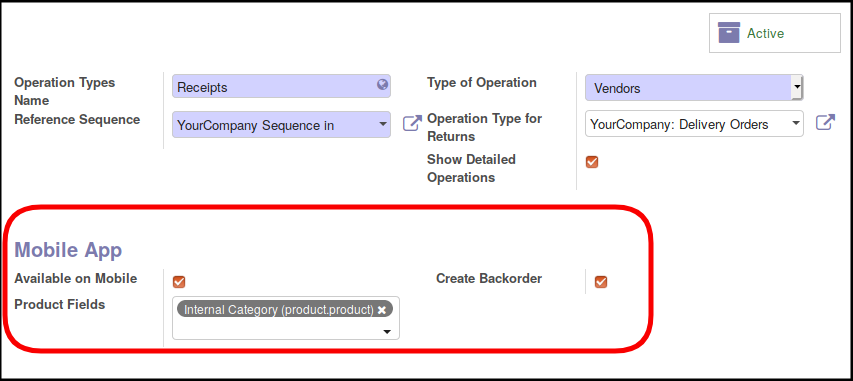

* Go to 'Inventory' / 'Configuration' / 'Warehouse Management' / 'Operations Types'
* Select an operation type you want to handle with your mobile

* Check the box 'Available on Mobile'

Optionaly you can put two extra settings:

* 'Create backorder' if you want that confirm picking on the Mobile App
  generate or not a backorder by default.
* 'Product fields' to select extra custom fields that will be displayed
  on the mobile app.

