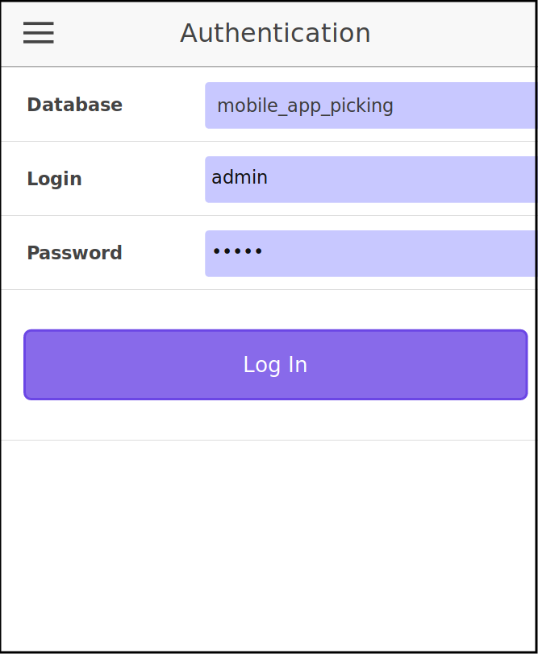
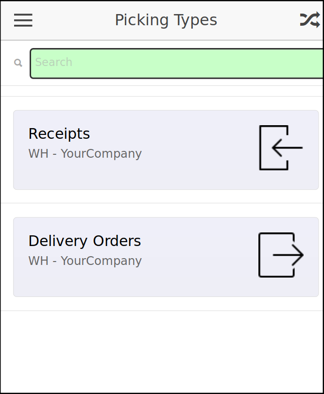
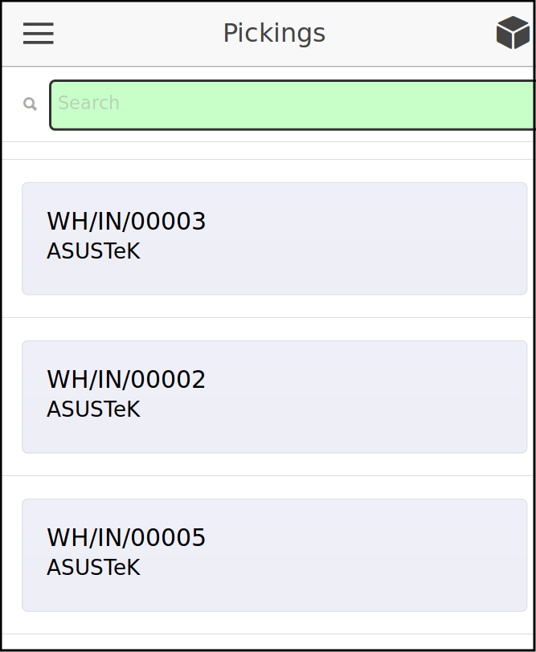
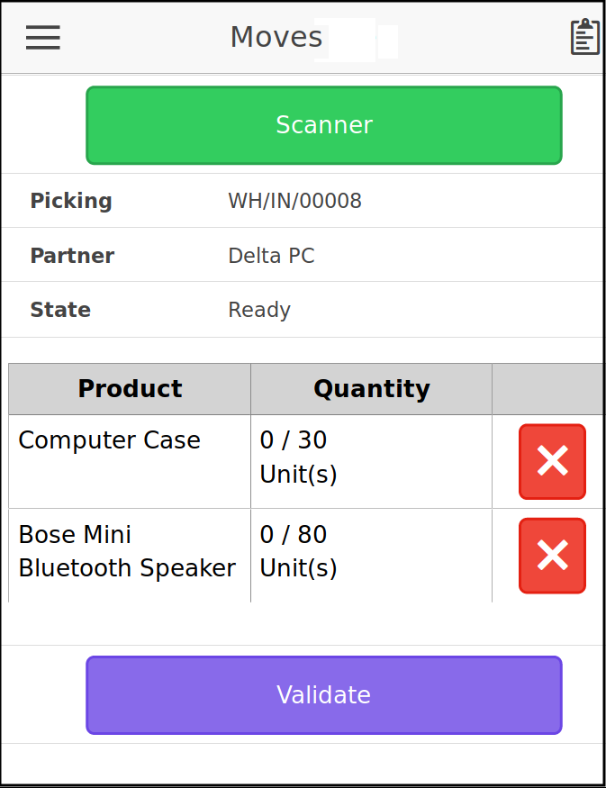
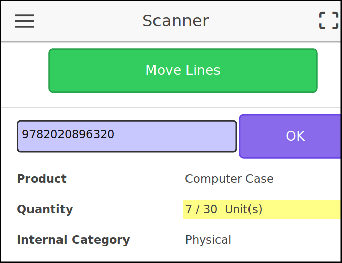
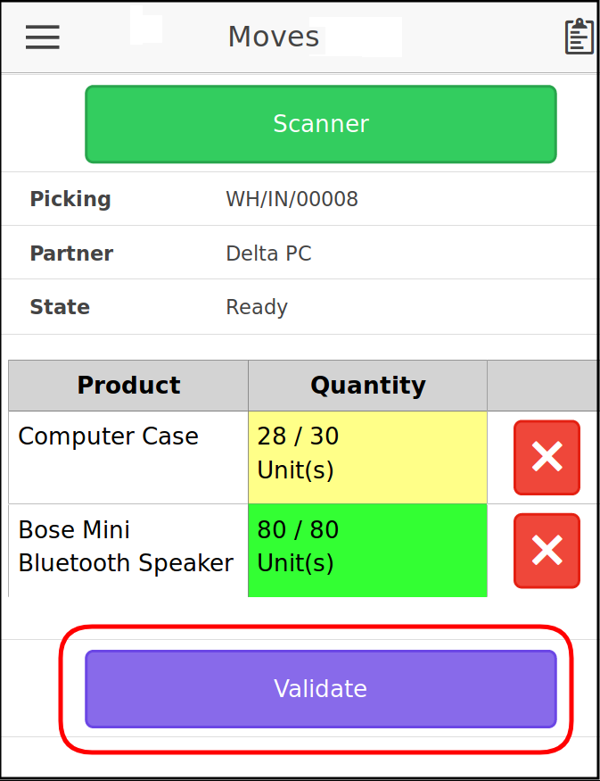

Enter the url http://MY-ODOO-INSTANCE/mobile_app_picking/static/www/index.html

You can also enter the url http://MY-ODOO-INSTANCE/mobile_app_picking
if all your odoo databases have ``mobile_app_picking`` installed.

+----------------------------------------------+------------------------------+
| Description                                  | Screenshot                   |
+==============================================+==============================+
|                                              |                              |
| Select a database (if your instance          |  |authentication|            |
| has many databases)                          |                              |
|                                              |                              |
| Enter your credentials and confirm           |                              |
|                                              |                              |
+----------------------------------------------+------------------------------+
|                                              |                              |
| Select a picking type                        |  |list_picking_type|         |
|                                              |                              |
+----------------------------------------------+------------------------------+
|                                              |                              |
| Select a picking.                            | |list_picking|               |
|                                              |                              |
| (you can scan its barcode)                   |                              |
|                                              |                              |
+----------------------------------------------+------------------------------+
|                                              |                              |
| The next screen displays the detail of the   | |list_move|                  |
| operations.                                  |                              |
|                                              |                              |
| To go the scan screen, click on the          |                              |
| 'Scanner' button                             |                              |
|                                              |                              |
| You can also click on a move line            |                              |
|                                              |                              |
+----------------------------------------------+------------------------------+
|                                              |                              |
| Scan the product barcode:                    | |scan_mode|                  |
|                                              |                              |
| This will display the detail of the          |                              |
| operation. (expected and done quantity,      |                              |
| the UoM, and also extra fields you could     |                              |
| have set in the picking type configuration)  |                              |
|                                              |                              |
| Everytime you scan a product, the done       |                              |
| quantity will be increased by 1.             |                              |
|                                              |                              |
| You can also put a custom quantity in the    |                              |
| field if it is easy for your operator        |                              |
| to count the number of products              |                              |
|                                              |                              |
| At the end of the process, go back to        |                              |
| the list of move lines, by clicking on       |                              |
| the according button.                        |                              |
|                                              |                              |
+----------------------------------------------+------------------------------+
|                                              |                              |
| You can reset a quantity if you did a bad    | |list_move_change|           |
| operation, by clicking on the button on the  |                              |
| end of each line.                            |                              |
|                                              |                              |
| When your picking is finished, click on the  |                              |
| 'Validate' button.                           |                              |
|                                              |                              |
+----------------------------------------------+------------------------------+
|                                              |                              |
| It will create a                             |                              |
| backorder or not, depending on the           |                              |
| setting of the picking type.                 |                              |
|                                              |                              |
| Once validated, the screen will go the       |                              |
| screen to select another picking.            |                              |
+----------------------------------------------+------------------------------+

**Colors depending on the quantity**

The field quantity will have a different background color depending on the
difference between expected and done quantity :

* ``white`` : no quantity set
* ``yellow`` : expected quantity not reached
* ``green`` : done quantity corresponds to the expected quantity
* ``red``: done quantity is over the expected quantity

.. |confirmation| image:: ../static/description/mobile_07_confirmation.png
   :width: 300 px

**Typical Errors and Warning at the login screen**

* It will not possible to log in if the user is not member of the
  'Warehouse / User' group.

**Typical Errors and Warning at the scanner screen**

* 'Incorrect quantity' if the quantity entered is negative, or is not a float.

* 'Barcode not found in the picking' if the operator tries to scan a product
  that is not in the list of move lines.

* 'Many operations found' if there are many lines with the same products.
  In that case, the operator should select manually the line he want to treat.
