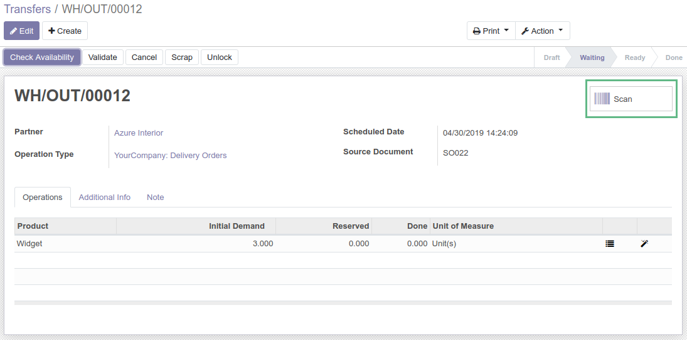
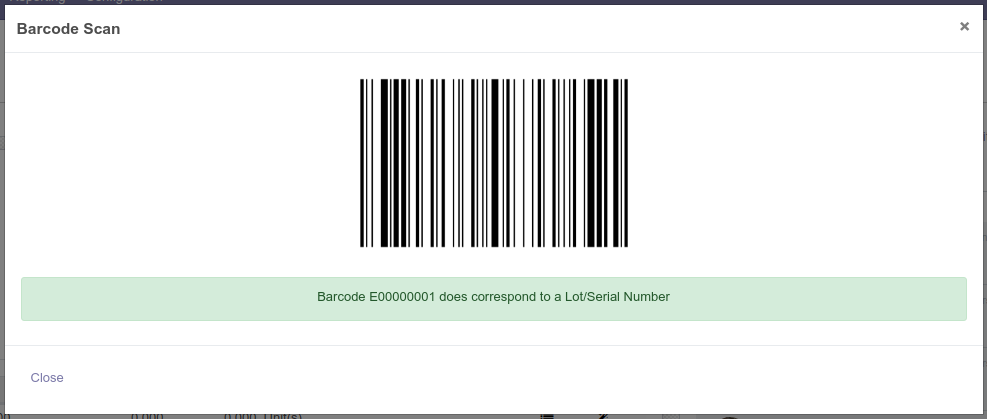
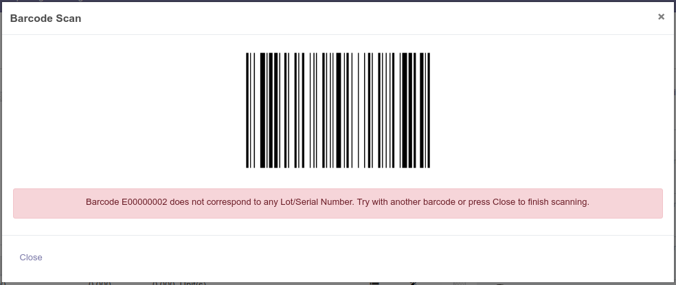
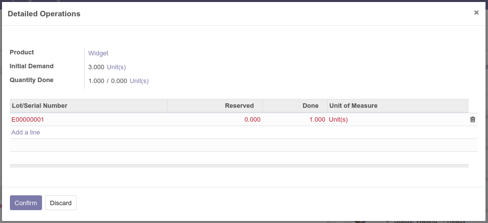

To use this module you need a barcode scanner.

In Odoo, click on the scan button in the picking form:

Scan the Serial Number Barcode. If the SN is in the system a success message
will be displayed. Otherwise, an error message will appear.

* Successful scan:

* Wrong SN:

After scanning a product, it will be added to the picking with the corresponding
scanned serial number.

