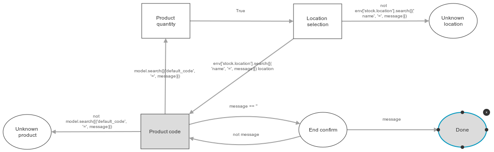

.. image:: https://img.shields.io/badge/licence-AGPL--3-blue.svg
   :target: http://www.gnu.org/licenses/agpl-3.0-standalone.html
   :alt: License: AGPL-3

==================================
Stock scanner : Inventory scenario
==================================

This module installs a scenario which allows the user to create and validate an inventory.

Installation
============

Just install the module from Odoo.

Description
===========

The scenario starts by a loop containing these three steps :

* Product name input
* Quantity input
* Location name input

When the user enters an empty value for the product's name, this ends the loop, and goes to the "End confirm" step.

If the user confirms, the inventory is validated, otherwise, the scenario returns to the product name input step.

Bug Tracker
===========

Bugs are tracked on `GitHub Issues
<https://github.com/OCA/stock-logistics-barcode/issues>`_. In case of trouble, please
check there if your issue has already been reported. If you spotted it first,
help us smashing it by providing a detailed and welcomed feedback.

Credits
=======

Images
------

* Odoo Community Association: `Icon <https://github.com/OCA/maintainer-tools/blob/master/template/module/static/description/icon.svg>`_.

Contributors
------------

* Sylvain Garancher <sylvain.garancher@syleam.fr>

Maintainer
----------

.. image:: https://odoo-community.org/logo.png
   :alt: Odoo Community Association
   :target: https://odoo-community.org

This module is maintained by the OCA.

OCA, or the Odoo Community Association, is a nonprofit organization whose
mission is to support the collaborative development of Odoo features and
promote its widespread use.

To contribute to this module, please visit https://odoo-community.org.
